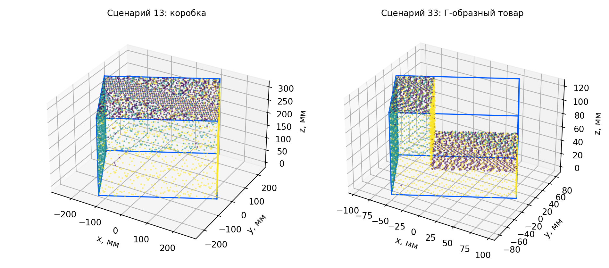

# Измерение габаритов товаров на конвейере

Решение варианта 1 трека «Компьютерное зрение» мастерской Ozon Tech - Иннополис, 2026.

**[Отчёт PDF](output/pdf/ozon_dimensioning_report.pdf)** · [Текст отчёта](docs/report.md) · [Результаты](results/summary.json) · [Соответствие заданию](docs/acceptance.md)

Проект измерительного поста для конвейера шириной 600 мм и скоростью 1 м/с. Три профилометра снимают поверхность товара; программа вычисляет упаковочные габариты и передаёт результат со статусом качества в WMS. В репозитории находятся расчёты установки, прототип обработки облаков и результаты синтетических испытаний.



## Решение

- Три Gocator 2490: сверху и с двух боковых направлений; общий энкодер через Master 810.
- Координаты привязаны к перемещению ленты. Проектная частота 800 профилей/с даёт шаг 1,25 мм при 1 м/с.
- Локальная обработка: общая система координат, отделение ленты, выпуклая оболочка, приближённый поиск минимального OBB.
- WMS получает размеры в миллиметрах или `review` с причиной. SQLite outbox сохраняет результаты и повторяет доставку.

## Проверенные результаты

<!-- results:start -->
В комплекте 47 синтетических сценариев. В штатной группе из 34 проходов все диагностические кандидаты уложились в допуск `max(5%, 5 мм)`; максимальная ошибка 1.28 мм. Контроль качества принял 32 прохода (94.1%), ещё 2 получили `review`. Во всей серии: 13 результатов `review`, ошибочных принятий среди 32 принятых случаев с эталоном - 0. Полная статистика: [benchmark.csv](results/benchmark.csv).

Автоматические тесты: 74, все прошли. Независимый численный поиск проверяет 27 полных облаков в той же конфигурации, что использует CLI. Максимальное превышение объёма относительно лучшего независимого решения - 0.187%. Покомпонентное сравнение рёбер прошло на 27 облаках; равные минимумы клина учитываются отдельно. Точки и найденные коробки: [geometry_crosscheck.json](results/geometry_crosscheck.json).

Скрытый сбой энкодера, одиночные и групповые ложные отражения, недостаточные ракурсы и отсутствующие подтверждения качества направляются на повторную проверку. Результаты относятся к синтетической модели и указанным контрольным фигурам.
<!-- results:end -->

## Запуск

Проверенное окружение: Python 3.12. Для Windows команда активации: `.venv\Scripts\activate`.

```bash
python3.12 -m venv .venv
source .venv/bin/activate
python -m pip install -r requirements-lock.txt
python -m pip install --no-deps -e .
python -m ruff format --check src scripts tests
python -m ruff check src scripts tests
python -m pytest -q
python -m ozon_dimensioner.cli demo --output results --seed 42
```

Для установки только вычислительного ядра: `python -m pip install -e .`. Тестовые зависимости: `python -m pip install -e '.[dev]'`. Полный набор для отчёта: `python -m pip install -e '.[dev,report]'`.

Демонстрация сохраняет сводку JSON, таблицу CSV, сообщения WMS и несколько облаков NPZ. Случайная геометрия воспроизводится по seed. Задержки зависят от оборудования.

### Измерение записанного облака

NPZ содержит `points` формы N×3, в миллиметрах, в общей системе координат с плоскостью ленты z=0. Для автоматического принятия обязателен целочисленный массив `sensor_ids`: 0 - верхний, 1 - левый, 2 - правый сенсор. Требуются хотя бы два ракурса с десятью точками каждый. Пример с синтетическим облаком:

```bash
python -m ozon_dimensioner.cli measure results/cloud_013.npz \
  --output /tmp/measurement.json --measurement-id example-001 \
  --expected-profiles 960 --received-profiles 960 \
  --calibration-id synthetic-v1 --qualified --calibration-valid --motion-valid
```

Счётчики в примере демонстрируют интерфейс; при реальном воспроизведении их берут из журнала сбора. `--qualified`, `--calibration-valid` и `--motion-valid` подтверждают квалификацию поверхности, калибровки и движения по протоколам поста. В примере их задаёт синтетический сценарий. По умолчанию результат получает `review`.

В контракте 1.1 `dimension_convention=obb_edges_descending`: `dimensions_mm.length/width/height` и массив `obb_dimensions_sorted_mm` содержат рёбра OBB по убыванию. `height_z_mm` хранит высоту над плоскостью ленты, `obb_axes` - столбцы ориентации OBB в координатах поста. При наклоне товара вертикальная высота отличается от кратчайшего ребра. Для `review` эти поля равны `null`; диагностическая коробка остаётся в `candidate_box`.

### Локальная демонстрация приёма WMS

```bash
python scripts/wms_demo_server.py --port 8765
```

Во втором терминале:

```bash
python -m ozon_dimensioner.cli send results/measurements.json \
  --database /tmp/ozon-outbox.sqlite \
  --url http://127.0.0.1:8765/measurements
```

При повторной отправке тот же ID применяется получателем один раз. Сервер демонстрационный, хранит полученные ID в памяти процесса и слушает только localhost. Промышленный WMS должен сохранять ключи идемпотентности долговременно. Команда `send` выполняет один проход очереди; ожидающие результаты остаются в SQLite.

### Завершение review

Товар с `review` направляется на резервный пост. После независимого измерения оператор передаёт протокол: источник, прибор, время, три ребра минимального OBB и неопределённости. Метод `manual_cuboid` применяется к проверенной прямоугольной упаковке; `reference_3d` - к полной метрологической съёмке. Проверка минимального OBB и квалификация прибора входят во внешний протокол.

Синтетический пример использует известную коробку 200×100×40 мм:

```bash
python -m ozon_dimensioner.cli resolve results/measurements.json \
  docs/examples/reference_measurement.json \
  --output /tmp/resolved_measurement.json
python -m ozon_dimensioner.cli send /tmp/resolved_measurement.json \
  --database /tmp/ozon-outbox.sqlite \
  --url http://127.0.0.1:8765/measurements
```

Сначала отправьте исходные сообщения командой из предыдущего раздела. Ответ получает новый `measurement_id` и ссылку `resolution_of`; исходный `review` сохраняется. WMS допускает одно закрытие каждого кейса и подтверждает повторную доставку. Контроль выполняется командой `python scripts/check_delivery.py`: 47 первичных сообщений и один ответ резервного поста. Поля высоты над лентой и ориентации во внешней записи равны `null`. Правила маршрутизации и расчёт мощности резерва приведены в разделе 8.1 отчёта.

## Воспроизведение отчёта

```bash
python -m pytest -q --junitxml=results/tests.xml
python -m ozon_dimensioner.cli demo --output results --seed 42
python scripts/validate_geometry.py
python scripts/benchmark_load.py
python scripts/check_delivery.py
python scripts/make_figures.py
python scripts/build_report.py
python scripts/check_artifacts.py
```

PDF и блок результатов README собираются из `docs/report.md`, метрик и XML тестов. Шрифты DejaVu входят в установленный Matplotlib. Текст с подставленными метриками: [report_resolved.md](results/report_resolved.md). Для форматирования Python используется `python -m ruff format src scripts tests`; CI проверяет формат, выполняет статический анализ и запускает тесты.

## Модель и область применимости

Симулятор пересекает треугольную поверхность последовательными плоскостями, выбирает первые пересечения лучей и добавляет шум и пропуски. Так моделируются дискретизация и затенение в плоскости лазера. Квалификацию поверхности, состояние калибровки и движение задаёт сценарий.

Поиск использует `hull_slsqp` для оболочек до 256 вершин и `hull_powell` для больших оболочек. Вторая ветвь ограничена тремя стартами по 400 оценок; каждая оценка учитывает все вершины. Итоговые экстремумы вычисляются по полному облаку. `global_optimum_certified=false` обозначает численный характер решения. Проверки объёма, каждого ребра и равных минимумов описаны в разделах 7 и 11 отчёта.

Связность проверяется на сетке 4 мм с 26 соседями. Разрыв даёт `disconnected_cloud`; исходные экстремумы сохраняются в диагностике. Различие продольных границ ракурсов свыше 3 мм даёт `views_inconsistent`. Затенение также может вызвать консервативный отказ.

На физическом стенде предстоит проверить видимость камеры триангуляции, отражение и преломление, механику ленты и калибровку. Разделы 5, 11 и 12 отчёта задают критерии точности, выборку товаров и маршрут повторного измерения.

Нагрузочный тест сочетает 3,7 млн точек и 10 000 вершин оболочки; отдельно измеряет ядро OBB и полную функцию `measure`. Все повторы сохранены в [load_benchmark.json](results/load_benchmark.json). Промышленный проект рассчитан на два процесса обработки, 20 товаров/мин и участок ожидания до сортировки; производительность выбранного IPC проверяется на стенде.

## Структура

| Каталог | Содержание |
| --- | --- |
| `src/ozon_dimensioner` | Геометрия, симулятор, обработка, очередь и CLI |
| `tests` | Геометрические и интеграционные тесты |
| `scripts` | Проверка геометрии, демо WMS, рисунки, сборка и аудит PDF |
| `docs` | Источник отчёта, рисунки, контракт и проверка требований |
| `results` | Зафиксированный прогон, облака, метрики и проверки |
| `output/pdf` | Готовый отчёт |

Перед стендовым внедрением подтвердить измерение товара 10×10×10 мм и сложных поверхностей при выбранной экспозиции, затем выполнить приёмочную матрицу из раздела 11 отчёта.
